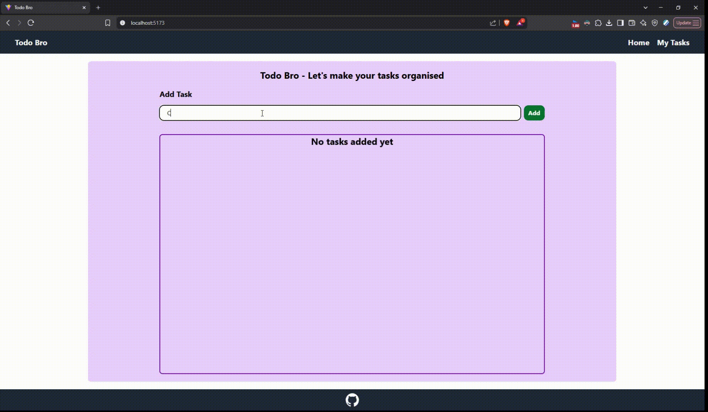

# ToDo Bro

This is a simple ToDo List app built using **ReactJS**. It uses **React Hooks** to manage and store the state, allowing tasks to be added, edited, deleted, and marked as completed—all without reloading the page. The app also saves your tasks in the browser's **localStorage** so your list persists even after refreshing.

## Demo

**Features:**
- Add new tasks
- Edit existing tasks
- Delete tasks
- Mark tasks as completed (with a checkbox that crosses over the task)
- State is managed with React Hooks and synced to localStorage

**Styling:**  
The app uses **TailwindCSS** for a modern and responsive design.  
It is also **very responsive** and works well on all device sizes.